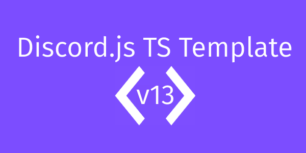

    

---

## Purpose
This projects allow for the quickstart of development when creating a Typescript Discord Bot, it handles linting configuraiton & basic Typescript setup.

## Requirements
- NodeJS v16.x or above ([Download](https://nodejs.org/en/))
- Node Package Manager (Bundled with Node)

## Setup & Configuration

1. Install packages with `npm ci` or `yarn`
2. Rename `example.config.yml` to `config.yml` and enter required fields.`
3. Run the project with `npm run start` or `yarn run start`

## Project Notes
- If you want to add a new value to `config.yml` or `storage.yml`, also add it to `config.ts`.

- To create a new command, simply use the format shown in existing commands.

- ESLint is configured & provided as a dependancy. To run ESLint, you can use the script with `npm run lint` or `yarn run lint`, if you want to fix all auto-fixable problems use `npm run lint:fix` or `yarn run lint:fix`

---
##### Help support my personal bot written in typescript too!
- [Support Server](https://support.bucketbot.dev)
- [Invite](https://invite.bucketbot.dev)
- [GitHub](https://github.com/KingOKarma/KFCBot)
